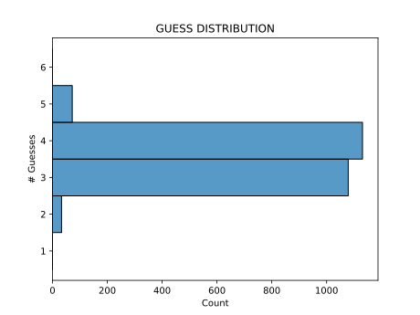

# Wordle Solver

Code to generate close-to-optimal guesses for the [Wordle](https://www.powerlanguage.co.uk/wordle/) puzzle game.
The game asks the player to guess a hidden word by making repeated, one-word guesses.
For each guess, the game returns a "coloring" that indicates, for each letter, whether the letter is in the hidden word and also whether the letter (if in the hidden word) is in the correct position.
There are  possible colorings, where *n* is the word-length.

The algorithm uses a greedy approach to find the hidden word.
At each step, the algorithm finds the guess that maximizes the entropy of the distribution of remaining possible hidden words over the  possible colorings.
Based on the coloring generated by the guess, the algorithm is able to iteratively restrict the set of possible hidden words until only the correct hidden word remains.

## Performance


Pursuing a maximum-entropy strategy is boring, but reliable!
The app is always able to find the Wordle in at least 6 guesses.
In a rare few cases it gets it in 2 tries.
But, sadly, it will never achieve the dream of the Wordle hole-in-one, as it chooses "SOARE" as maximum-entropy starting guess.

Also by virtue of this approach we do quite well even against an adversarial opponent like [Absurdle](https://qntm.org/files/wordle/)!
Because of the dynamic approach used there, to get interesting results please try the `custom_start` option in the `Wordler.start` method.
Finding the hidden word in 5 or 6 tries was typical of my Absurdle experience.

### Speed
Precomputation of data takes about a minute (73 seconds) but only needs to be completed the first run of the application.

The precomputed data take a few seconds to load, but finding optimal guesses takes less than a second for these small word-lengths.

This algorithm is not truly optimal (See [Cyrus Freshman's leaderboard](https://freshman.dev/wordle/#/leaderboard)), but performs almost as well as exhaustive methods, with an average guesses-per-word of 3.53.

## Usage
First, install dependencies into a conda environment (named "wordle_solver")
```
conda env create -f environment.yml
```
and activate the environment.
```
conda activate wordle_solver
```

# Pip Installation
Install dependencies using pip install -r requirements.txt

To use the simple commandline app with the python interpreter, simply:

```
>>> python3 src/app.py
Checking existance of precompted data...
Loading data...
Guess SOARE (entropy 5.89)
Enter Wordle response for "SOARE" (0=gray, 1=yellow, 2=green):	00000
Guess CLINT (entropy 5.51)
Enter Wordle response for "CLINT" (0=gray, 1=yellow, 2=green):	01102
Choose randomly from "LIGHT" or "LIMIT"
>>>
```

Here's an example with Absurdle:
```
>>> wordler.start(max_guesses=10, custom_start="arise")
Guess ARISE (entropy 5.82)
Enter Wordle response for "ARISE" (0=gray, 1=yellow, 2=green):	00000
Guess MULCH (entropy 5.21)
Enter Wordle response for "MULCH" (0=gray, 1=yellow, 2=green):	00000
Guess GOODY (entropy 3.25)
Enter Wordle response for "GOODY" (0=gray, 1=yellow, 2=green):	02202
Guess BLITZ (entropy 2.00)
Enter Wordle response for "BLITZ" (0=gray, 1=yellow, 2=green):	00001
Choose "WOOZY"
```

See the included `example.py` for an example of guessing the hidden word "crimp" for Wordle using the backend.

## Acknowledgments
Many thanks to [Josh Wardle](https://powerlanguage.co.uk/), creator of Wordle, [qntm](https://qntm.org/), creator of Absurdle, and [Cyrus Freshman](https://freshman.dev/), who hosts the Wordle bot leaderboard.